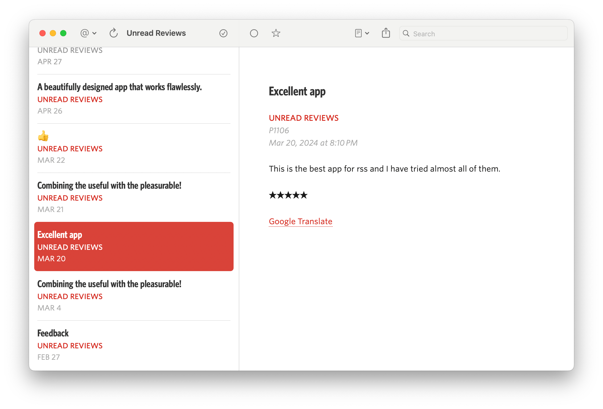

# App Store Review Feed

App Store customer reviews are available via Atom feeds, but using those feeds directly has some drawbacks:

* In order to get all reviews across all storefronts (countries), you need to subscribe to a feed for each storefront.
* The feed names do not include the name of the app.
* The feeds include the star ratings, but not in a manner that a news reader or an aggregation service will incorporate.
* The atom feeds appear to be less reliable than JSON-formatted equivalent feeds, at least in my limited experience testing them. However the JSON-formatted feeds are not in a standard format that can be read by an RSS reader or aggregation service.
* Not all reviews are written in a language that the developer can read.

This script generates JSON Feeds based on those Atom feeds, addressing these weaknesses:

* The script will generate one feed per app.
* The feed name will be “App Store Reviews of [PRODUCT_NAME]”
* The feeds will include the star rating in the body of each review.
* The feeds include a Google Translate link at the bottom of each review in case the review is in a language foreign to the developer.




## Installation

The script requires Ruby 2.3 or later and Bundler 1.11.2 or later. It is intended to run on a Linux or UNIX system that has a web server. To get started, do the following:

1. Check out the repository.
2. cd into the directory.
3. Copy “config.yaml.template” to “config.yaml”.
4. Create a directory inside your web server‘s root directory for the feeds. Ensure that the user account that will run the script has write access to that directory.
5. Edit the config.yaml file. At minimum you will need to customize the list of apps for which you want feeds.
6. Install dependencies by entering “bundle install”.
7. To run the script, type “bundle exec ruby generate_feeds.rb”.
8. To configure the script to run automatically, add a crontab entry such as the following

````
2 */4 * * * cd /home/myaccount/app-store-review-feed && /usr/bin/bundle exec ruby generate_feeds.rb >/dev/null 2>&1
````

This will tell cron to run the script every four hours at two minutes past the hour. You will want to customize that. You will also need to replace “/home/myaccount/app-store-review-feed” with the appropriate directory and “/usr/bin/bundle” with the path to your bundle binary.

After you have executed the script at least once, you can subscribe to the resulting JSON Feeds from your news reader or aggregation service.

## Notes

* This script will only retrieve the first page of each feed. It will combine all reviews of an app into a one-page feed. This might be inadequate for an app with a very high volume of reviews.
* Not every news reader or aggregation service supports JSON Feed.
* The script is single-threaded. By default it sleeps for two seconds between every HTTPS request to Apple. This makes the script take about 8 minutes per app. It prioritizes playing nicely with Apple’s servers over speed.

## See Also

* [App Store Reviews](https://github.com/jcoynel/app-store-reviews): A node.js module by Jules Coynel to download user reviews from the iTunes Store and the Mac App Store.

Pull requests welcome.
